# sim-ngspice

Exemplos do uso da ferramenta NGSPICE para simular circuitos
eletônicos.

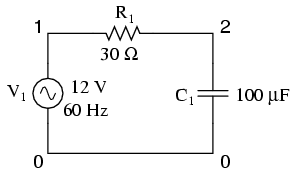
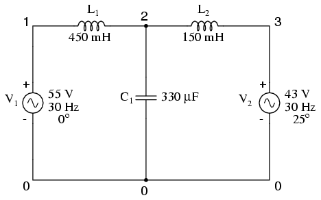
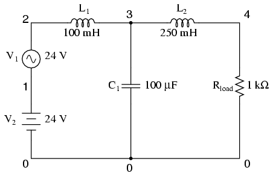
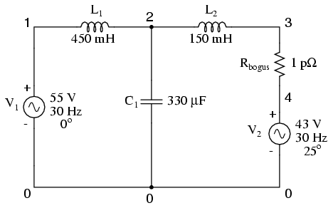
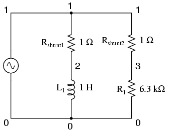
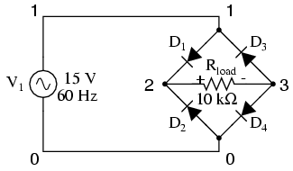
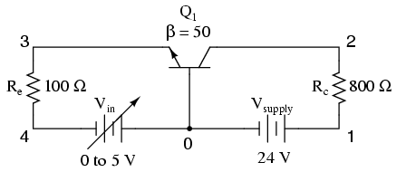
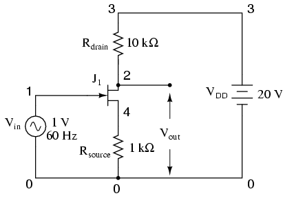
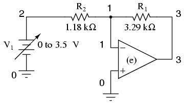
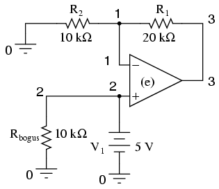
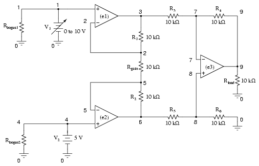
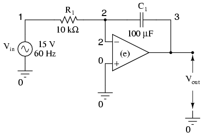
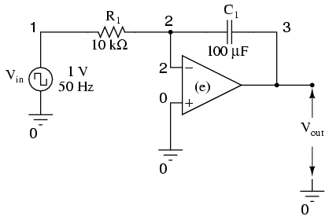
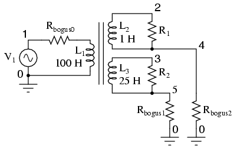

## Installation

## Credits:

Simulation based on *Bruno F Estevão* presentation.

Credits:
[Bruno F Estevão](https://www.youtube.com/channel/UCMADYCh_lVVftRxJX4f0A4w)

## License

Copyright © 2019 Ivan Carlos S. Lopes

This program is free software: you can redistribute it and/or modify
it under the terms of the GNU General Public License as published by
the Free Software Foundation, either version 3 of the License, or
(at your option) any later version.

This program is distributed in the hope that it will be useful,
but WITHOUT ANY WARRANTY; without even the implied warranty of
MERCHANTABILITY or FITNESS FOR A PARTICULAR PURPOSE.  See the
GNU General Public License for more details.

You should have received a copy of the GNU General Public License
along with this program.  If not, see <http://www.gnu.org/licenses/>.
Vim itself.
See `:help license`.

## end doc
